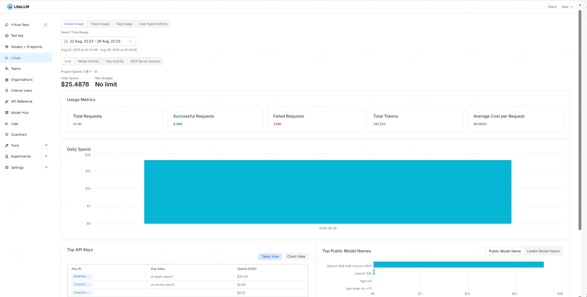
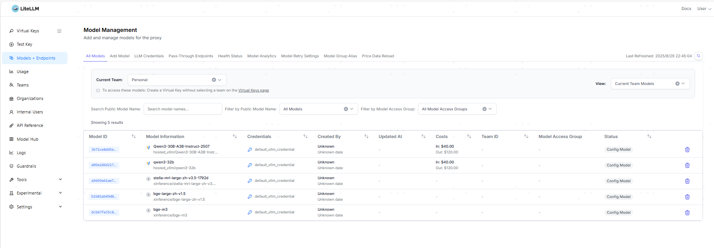
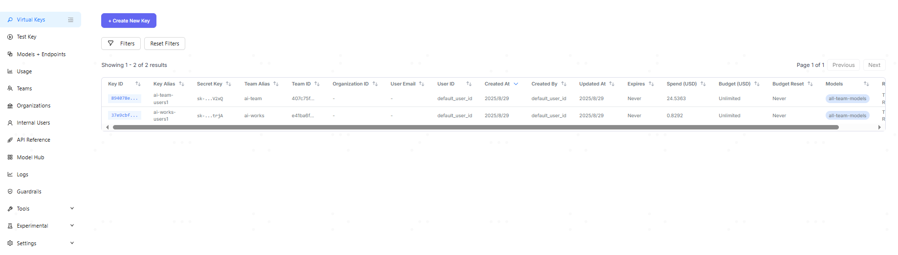
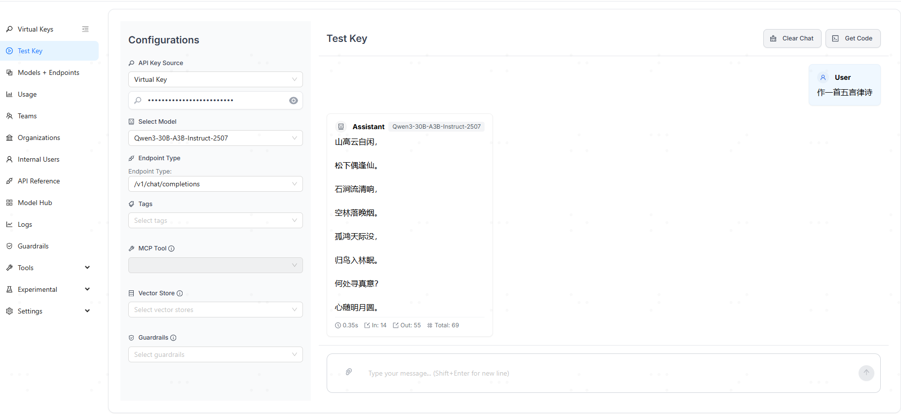
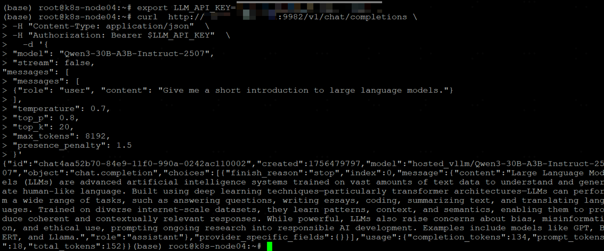

'''本地模型，嗯，也可以支持根据token收费统计了。年底拿着账单告诉老板，看看我们这个本地部署的模型给你节约了多少多少。'''


## litellm


#### 仓库简介

| git仓库 | 地址 | 主要功能 | star/fork数
|:-|:-|:-|:-
| litellm |  [BerriAI/litellm](https://github.com/BerriAI/litellm.git) | 模型服务集成管理 | 28k/4k


#### 内容简介


- litellm可以干啥呢?
    - LiteLLM旨在简化多种大型语言模型（LLM） API 的集成。 通过支持来自众多提供商的超过 100 种 LLM 服务，它使用户能够使用标准化的 OpenAI API 格式与这些模型进行交互。
    - 支持 **模型管理、api-key管理、请求并发设置、token吞吐量收费设置**
    - 详细的帮助文档，可参考[LiteLLM
帮助文档](https://docs.litellm.com.cn/docs/providers/xinference#sample-usage---embedding)


#### demo页面




#### 使用步骤

- 1. 构建容器
    - 在下面step2的配置文件之后执行

```sh
export VLLM_API_KEY=llm-key
docker compose -f docker-litellm.yml up -d
docker compose -f docker-litellm.yml down -v
```


- 2. 新增配置文件
    - 本文所有的模型都是基于xinference起的，包括llm/embedding/模型
    - 关于xinference的使用方法，可参考【xinference】
    - 1）对于model, 当前litellm关于xinference仅支持embedding，所以对于llm模型，xinference如果是vllm方式起的，增加个 **hosted_vllm** 即可
    - 2）对于litellm_credential_name，可以设置vllm或者其他模型的api-key/api-host信息
    - 3）对于input/output_cost_per_token，即为每个token吞吐的价格
    - 4）对于rpm，表示每分钟支持的请求数


| model_name                          | mode      | model                           | litellm_credential_name     | input_cost_per_token | output_cost_per_token | rpm  |
|-------------------------------------|-----------|----------------------------------|-----------------------------|----------------------|-----------------------|------|
| Qwen3-30B-A3B-Instruct-2507         | -         | hosted_vllm/Qwen3-30B-A3B-Instruct-2507 | api_key/api_base     | 0.00004              | 0.00012               | 6000|
| qwen3-32b                           | chat      | hosted_vllm/qwen3-32b            | api_key/api_base     | 0.00004              | 0.00012               | -    |
| stella-mrl-large-zh-v3.5-1792d      | embedding | xinference/stella-mrl-large-zh-v3.5-1792d | api_key/api_base     | -                    | -                     | -|
| bge-large-zh-v1.5                   | embedding | xinference/bge-large-zh-v1.5     | api_key/api_base     | -                    | -                     | -    || bge-m3                              | embedding | xinference/bge-m3                | api_key/api_base     | -                    | -                     | -    |


```sh
# vim config.yaml
model_list:
  - model_name: Qwen3-30B-A3B-Instruct-2507
    litellm_params:
      model: hosted_vllm/Qwen3-30B-A3B-Instruct-2507
      litellm_credential_name: default_vllm_credential
      rpm: 6000
      input_cost_per_token: 0.00004
      output_cost_per_token: 0.00012
    model_info:
      mode: chat
  - model_name: stella-mrl-large-zh-v3.5-1792d
    model_info:
      mode: embedding
    litellm_params:
      model: xinference/stella-mrl-large-zh-v3.5-1792d
      litellm_credential_name: default_vllm_credential

general_settings: 
  master_key: sk-master-key 
  database_url: "postgresql://{username}:{passwd}@db:5432/litellm"
  database_connection_pool_limit: 100
  database_connection_timeout: 60

credential_list:
  - credential_name: default_vllm_credential
    credential_values:
      api_key: os.environ/VLLM_API_KEY
      api_base: http://*.*.*.*:9999/v1
    credential_info:
      description: "vllm info"

litellm_settings:
  request_timeout: 600
  budget_duration: 30d
  max_parallel_requests: 200
  input_cost_per_token: 0.00004
  output_cost_per_token: 0.00012
```


- 3. 模型管理
    - LLM_API_KEY为通过litellm设置的虚拟key
    - LLM_HOST作为litellm对应的节点
    - **api_base尽量不要传参，写详细地址即可**

```sh
export LLM_API_KEY="sk-master-key"
export LLM_HOST="*.*.*.*"
# 添加新chat模型
curl -X POST "http://$LLM_HOST:9982/model/new" \
    -H "accept: application/json" \
    -H "Content-Type: application/json" \
    -H "Authorization: Bearer $LLM_API_KEY"  \
    -d '{ "model_name": "qwen3-32b", 
          "litellm_params": {"model": "hosted_vllm/qwen3-32b", 
                             "api_key": "os.environ/AZURE_API_KEY",
                             "api_base": "http://$LLM_HOST:9999/v1",
                             "input_cost_per_token": "0.00004",
                             "output_cost_per_token": "0.00012"}, 
          "model_info":{"mode":"chat"}}'


# 添加新embedding模型
curl -X POST "http://$LLM_HOST:9982/model/new" \
    -H "accept: application/json" \
    -H "Content-Type: application/json" \
    -H "Authorization: Bearer $LLM_API_KEY"  \
    -d '{ "model_name": "bge-m3", 
          "litellm_params": {"model": "xinference/bge-m3", 
                             "api_key": "os.environ/AZURE_API_KEY",
                             "api_base": "http://$LLM_HOST:9999/v1"}, 
          "model_info":{"mode":"embedding"}}'

# 查看模型清单
curl -X GET "http://$LLM_HOST:9982/model/info" -H "accept: application/json" -H "Content-Type: application/json" -H "Authorization: Bearer $LLM_API_KEY" 
```





- 4. 虚拟key的管理
    - 主要包括两部分内容，虚拟key的管理以及测试功能






#### 验证方式


- 1. 模型/key验证

```sh
# chat模型测试
curl  http://$LLM_HOST:9982/v1/chat/completions \
-H "Content-Type: application/json"  \
-H "Authorization: Bearer $LLM_API_KEY"  \
  -d '{
"model": "qwen3-32b",
"stream": false,
"messages": [
{"role": "user", "content": "Give me a short introduction to large language models."}
],
"temperature": 0.7,
"top_p": 0.8,
"top_k": 20,
"max_tokens": 8192,
"presence_penalty": 1.5
}'

# embedding模型测试
curl -X 'POST'   http://$LLM_HOST:9982/v1/embeddings \
-H 'accept: application/json' \
-H 'Content-Type: application/json' \
-H "Authorization: Bearer $LLM_API_KEY"  \
-d '{
"model": "bge-m3",
"input": ["What is the capital of China?", "你先干啥"]
}'


# rerank模型--TODO项，暂不支持xinference起的rereank
curl -X 'POST' http://$LLM_HOST:9982/v1/rerank \
 -H 'accept: application/json' \
 -H 'Content-Type: application/json' \
 -H "Authorization: Bearer $LLM_API_KEY"  \
 -d '{
   "model": "bge-reranker-large",
   "query": "A man is eating pasta.",
   "documents": [
       "A man is eating food.",
       "A man is eating a piece of bread.",
       "The girl is carrying a baby.",
       "A man is riding a horse.",
       "A woman is playing violin."
   ]
 }'
```





- 2. psql

```sh
docker exec -it litellm-db-1 /bin/bash
psql -h localhost -p 5432 -U llmproxy -d litellm
show table;
```


## 其他内容


#### 环境说明

- 1. 系统环境

```sh
ubuntu1~22.04.2
NVIDIA A100-SXM4-80GB
Python 3.13.7
CUDA Version: 12.8
psql (PostgreSQL) 17.6 (Debian 17.6-1.pgdg13+1)
docker 27.5.1
```

- 2. python环境


```sh
litellm==1.76.0
litellm-enterprise==0.1.19
litellm-proxy-extras==0.2.18
```


#### docker镜像源

- 详细可参考docker-litellm.yml文件

```sh
name: litellm
services:
  litellm:
    image: ghcr.io/berriai/litellm:main-latest
    volumes:
     - ./config.yaml:/app/config.yaml
     - /etc/localtime:/etc/localtime
    command:
     - "--config=/app/config.yaml/config.yaml"
    ports:
      - "9982:4000"
    environment:
        DATABASE_URL: "postgresql://llmproxy:passwd@db:5432/litellm"
        STORE_MODEL_IN_DB: "True"
        VLLM_API_KEY: $VLLM_API_KEY
  db:
    image: postgres
    restart: always
    environment:
      POSTGRES_DB: litellm
      POSTGRES_USER: llmproxy
      POSTGRES_PASSWORD: passwd
    volumes:
     - /etc/localtime:/etc/localtime
    ports:
      - "5432:5432" 
    healthcheck:
      test: ["CMD-SHELL", "pg_isready -d litellm -U llmproxy"]
      interval: 1s
      timeout: 10s
      retries: 10
```